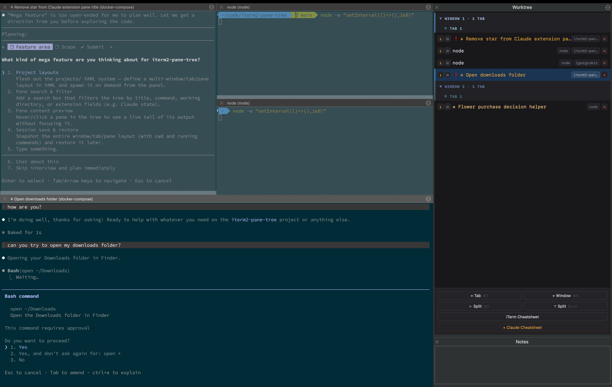

# iterm2-claude-cockpit

Live tree of every iTerm2 window, tab, and pane — purpose-built for orchestrating many Claude Code sessions side-by-side.

[](https://github.com/igorgrubic/iterm2-claude-cockpit/actions/workflows/ci.yml)
[](https://iterm2.com)
[](https://iterm2.com/python-api/)

Live tree of every iTerm2 window, tab, and pane — click to focus, create, or close sessions from a persistent side panel.



## Features

- Live hierarchical tree: window → tab → pane, updated in real time
- Click any node to focus it immediately
- Rename tabs inline (hover → ✎) or programmatically via `POST /api/rename-tab`; custom names persist until the tab or window is closed
- Per-pane status popup: current job, working directory, recent terminal output
- Click the folder pill to focus the pane; on the active pane, hover reveals "copy" and clicking copies its working directory to the clipboard
- Create new tabs and windows from the panel
- Bury and unbury sessions (hide a running pane without closing it)
- YAML project layouts — define a named set of tabs and open them with one click
- Settings panel (⚙ button) — shows the plugin version and installed extensions at a glance
- Optional extensions — opt-in modules can enrich the snapshot, inject CSS/JS into the panel, and add HTTP routes (see [Extensions](#extensions))
- Zero external dependencies — stdlib only, beyond the `iterm2` library bundled with iTerm2
- Runs as an AutoLaunch daemon; starts automatically with iTerm2

## Requirements

- macOS with iTerm2 3.5 or later
- Python API enabled (see step 1 below)

No separate Python installation needed — iTerm2 bundles its own runtime.

## Installation

### 1. Enable the Python API

`iTerm2 → Settings → General → Magic → ☑ Enable Python API`

### 2. Clone

**Option A — recommended for most users.** Clone directly into the AutoLaunch directory:

```bash
git clone https://github.com/igorgrubic/iterm2-claude-cockpit.git \
  "$HOME/Library/Application Support/iTerm2/Scripts/AutoLaunch/iterm_workflow"
```

**Option B — recommended for developers.** Clone anywhere and symlink:

```bash
git clone https://github.com/igorgrubic/iterm2-claude-cockpit.git ~/code/iterm_workflow
ln -s "$HOME/code/iterm_workflow" \
  "$HOME/Library/Application Support/iTerm2/Scripts/AutoLaunch/iterm_workflow"
```

> **Why `iterm_workflow`?** iTerm2's script loader requires the folder name, inner package name, and entry script name to all match. The repo is named `iterm2-claude-cockpit` but must be installed as `iterm_workflow`.

### 3. Run once from the Scripts menu

`Scripts → AutoLaunch → iterm_workflow → iterm_workflow.py`

iTerm2 will download its bundled Python runtime and set up the environment automatically. This only happens on the first run.

### 4. Allow the API permission prompt

Click **Allow** when iTerm2 asks for Python API access. The daemon starts immediately and will auto-launch on every subsequent iTerm2 start.

### 5. Show the panel

`View → Toolbelt → Show Toolbelt`, then right-click the toolbelt and tick **Worktree**.

iTerm2 remembers both settings, so this is a one-time step.

### Auto-open the panel in every new window (optional)

`Settings → Profiles → [your profile] → Window → ☑ Open toolbelt`

This is per-profile — repeat for any profile you use. Takes effect on the next new window.

### Updating

**Option A:**
```bash
cd "$HOME/Library/Application Support/iTerm2/Scripts/AutoLaunch/iterm_workflow" && git pull
```

**Option B:**
```bash
cd ~/code/iterm_workflow && git pull
```

Then re-run from `Scripts → AutoLaunch → iterm_workflow → iterm_workflow.py`, or restart iTerm2.

### Uninstalling

```bash
rm "$HOME/Library/Application Support/iTerm2/Scripts/AutoLaunch/iterm_workflow"
```

## Project layouts

Define a named set of tabs in `iterm_workflow/projects/example.yaml` and open them from the panel. See [`iterm_workflow/projects/example.yaml`](iterm_workflow/projects/example.yaml) for the format.

## Extensions

The core panel is a generic worktree manager. Anything Claude-specific (or other "goodies") lives in opt-in extensions under `iterm_workflow/extensions/`.

```bash
# from the repo / install root:
python3 -m iterm_workflow ext list
python3 -m iterm_workflow ext enable claude
python3 -m iterm_workflow ext disable claude
```

After enabling or disabling, restart iTerm2 — the toolbelt webview is loaded once on startup and does not hot-reload.

### Bundled extensions

- **claude** — detects Claude Code panes via a `ps -t <tty>` process check, tags them in the snapshot as `ext.claude.{active,state,action_needed}`, and decorates them in the panel (accent color, ❗ attention badge, blue plan-mode tint). Status is driven by Claude Code hook signal files; see [Claude Code integration](#claude-code-integration) for setup.

#### Claude Code integration

For accurate `running` / `idle` / `attention` states, run the interactive installer once:

```bash
python3 /path/to/iterm_workflow/extensions/claude/hooks/install.py
```

The installer explains every change it will make, shows before/after for each hook entry, and asks for confirmation before touching anything. It writes a `.bak` of your existing `~/.claude/settings.json` before modifying it.

<details>
<summary>What the installer adds (manual alternative)</summary>

```json
{
  "hooks": {
    "UserPromptSubmit": [
      {"hooks": [{"type": "command", "command": "/path/to/iterm_workflow/extensions/claude/hooks/notify.sh running"}]}
    ],
    "Stop": [
      {"hooks": [{"type": "command", "command": "/path/to/iterm_workflow/extensions/claude/hooks/notify.sh idle"}]}
    ],
    "Notification": [
      {"hooks": [{"type": "command", "command": "/path/to/iterm_workflow/extensions/claude/hooks/notify.sh attention"}]}
    ]
  }
}
```
</details>

To remove the hooks later:

```bash
python3 /path/to/iterm_workflow/extensions/claude/hooks/uninstall.py
```

Without hooks, panes where `claude` is the foreground process still show as active (amber) but state will default to `running` throughout the session.

### Authoring an extension

Create `iterm_workflow/extensions/<name>/__init__.py` exposing `register(api)`. The API (v1) lets you:

- `api.add_session_enricher(fn)` — add fields to each session node before serialization. `fn(session, node, ps_output, screen_lines, signals=None)` may be sync or async; return a dict to merge or mutate `node` in place. Use the `ext.<name>.<field>` namespace for new keys.
- `api.add_signal_dir_source(name, directory)` — register a directory of TTY-keyed JSON signal files written by in-pane hook scripts; the parsed payloads are passed to enrichers via the `signals` kwarg.
- `api.add_static_dir(path)` — serve a directory at `/static/ext/<name>/...`.
- `api.add_webview_asset("css"|"js", relpath)` — inject a `<link>` or `<script>` tag into the panel HTML.
- `api.add_route("GET"|"POST", path, handler)` — handle `/api/ext/<name>/<path>`. Async handlers run on the iTerm2 event loop.
- `api.add_action(name, handler)` — sugar for `add_route("POST", name, ...)`.

The webview exposes a small registry on `window.PaneTreeExt`:

- `paneRowDecorators: ((row, node) => void)[]`
- `paneTitleDecorators: ((label, node) => void)[]`
- `shouldShowJob: ((node) => boolean)[]` — return false to hide the job badge for a pane

Extension JS is loaded after `app.js`, so the registry exists when your script runs. See `iterm_workflow/extensions/claude/` for a complete example.

## Troubleshooting

**Check the console first:** `Scripts → Manage → Console` — Python tracebacks appear here.

**Verify the daemon is running:** `curl -s http://127.0.0.1:9876/` should return the panel HTML.

---

### The panel is blank / shows "connecting…"

The daemon isn't running. Check the console for errors, then re-run the script from `Scripts → AutoLaunch → iterm_workflow → iterm_workflow.py`.

---

### AutoLaunch never started the script — no permission prompt appeared

The venv doesn't exist yet. Run the script once manually from `Scripts → AutoLaunch → iterm_workflow → iterm_workflow.py`. iTerm2 will build the environment on first run.

---

### The Scripts menu shows nothing / the folder doesn't appear

The folder name must match the `.py` filename exactly, and both must be valid Python identifiers (underscores, not hyphens). If you renamed the folder, rename it back to `iterm_workflow`.

---

### `ModuleNotFoundError` in the console

The script is running as a Basic (shared) environment rather than Full Environment. This happens when the two-level folder structure or `setup.cfg` is missing. Make sure the layout is:

```
iterm_workflow/          ← the cloned/symlinked folder
├── setup.cfg
└── iterm_workflow/
    └── iterm_workflow.py
```

---

### Toolbelt shows the panel but it disappears on new windows

This is a per-profile setting. Enable it in `Settings → Profiles → [your profile] → Window → ☑ Open toolbelt` for every profile you use.

---

### The `defaults write com.googlecode.iterm2 OpenToolbelt -bool true` command doesn't work

In iTerm2 3.6+ the global `OpenToolbelt` defaults key is overridden by per-profile settings. Use the profile setting above instead.

---

### Log paths show `~/.config/iterm2/AppSupport/Scripts/...` even though I used `~/Library/Application Support/...`

iTerm2 3.6+ moved its support directory to an XDG-style path. The legacy `~/Library/Application Support/iTerm2/` location symlinks transparently to the new one — both work, the different path in logs is expected.

## Contributing

See [CONTRIBUTING.md](CONTRIBUTING.md).

## License

[MIT]
