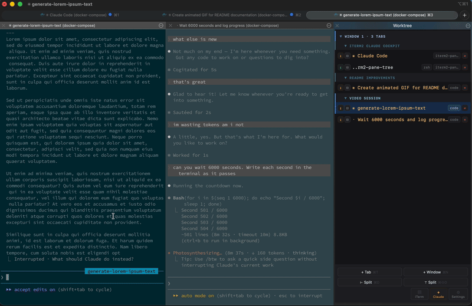

# iterm2-claude-cockpit

Live tree of every iTerm2 window, tab, and pane — purpose-built for orchestrating many Claude Code sessions side-by-side.

[](https://iterm2.com)
[](https://iterm2.com/python-api/)



## Features

- Live hierarchical tree: window → tab → pane, updated in real time
- Click any node to focus it immediately
- Rename tabs inline (hover → ✎) or programmatically via `POST /api/rename-tab`; custom names persist until the tab or window is closed
- Per-pane status popup: current job, working directory, recent terminal output
- Click the folder pill to focus the pane; on the active pane, hover reveals "copy" and clicking copies its working directory to the clipboard
- Create new tabs and windows from the panel
- Bury and unbury sessions (hide a running pane without closing it)
- YAML project layouts — define a named set of tabs and open them with one click
- Settings panel (⚙ button) — shows the plugin version and installed extensions at a glance
- Optional extensions — opt-in modules can enrich the snapshot, inject CSS/JS into the panel, and add HTTP routes (see [Extensions](#extensions))
- Zero external dependencies — stdlib only, beyond the `iterm2` library bundled with iTerm2
- Runs as an AutoLaunch daemon; starts automatically with iTerm2

## Requirements

- macOS with iTerm2 3.5 or later
- iTerm2's Python API enabled (see step 2 below)

No separate Python installation needed — iTerm2 bundles its own runtime.

## Installation

### 1. Clone and install

```bash
git clone https://github.com/igor-grubic/iterm2-claude-cockpit.git ~/code/iterm2_claude_cockpit
cd ~/code/iterm2_claude_cockpit
bash install.sh
```

`install.sh` validates iTerm2 + its bundled Python, removes any stale AutoLaunch entry from a previous install (with consent), and creates a single file symlink at:

```
~/Library/Application Support/iTerm2/Scripts/AutoLaunch/iterm2_claude_cockpit.py
```

iTerm2 runs this as a Basic script using its own bundled Python (which already has the `iterm2` library). No virtual environment to create, no "Full Environment" setup.

You can clone the repo anywhere — the symlink takes care of the AutoLaunch wiring.

### 2. Enable the Python API

`iTerm2 → Settings → General → Magic → ☑ Enable Python API`

### 3. Restart iTerm2

Cmd-Q, then reopen. Click **Allow** on the first-run API permission prompt. The daemon auto-launches on every subsequent iTerm2 start.

### 4. Show the panel

`View → Toolbelt → Show Toolbelt`, then right-click the toolbelt and tick **Claude Cockpit**.

iTerm2 remembers both settings, so this is a one-time step.

### 5. (Optional) Set up Claude Code status tracking

The Claude extension is enabled by default. Run its interactive installer to wire up accurate `running` / `idle` / `attention` states via Claude Code hooks:

```bash
python3 ~/code/iterm2_claude_cockpit/iterm2_claude_cockpit/extensions/claude/hooks/install.py
```

The installer explains every change, shows a before/after diff, and asks for confirmation before touching anything. It backs up your existing `~/.claude/settings.json` first.

### Auto-open the panel in every new window (optional)

`Settings → Profiles → [your profile] → Window → ☑ Open toolbelt`

This is per-profile — repeat for any profile you use. Takes effect on the next new window.

### Updating

```bash
cd ~/code/iterm2_claude_cockpit && git pull
```

Then restart iTerm2. The symlink picks up your latest code automatically; no re-install needed.

### Uninstalling

```bash
bash ~/code/iterm2_claude_cockpit/uninstall.sh
# optionally also remove the repo:
rm -rf ~/code/iterm2_claude_cockpit
```

`uninstall.sh` removes only the AutoLaunch symlink; the repo and your Claude Code hook config are left untouched.

### Migrating from a previous install

If you installed an earlier version (folder-based Full Environment install), `install.sh` detects and offers to clean up:

- the old folder symlink at `~/Library/Application Support/iTerm2/Scripts/AutoLaunch/iterm2_claude_cockpit`
- a leftover `iterm_workflow` entry from the pre-rename name

Both must be removed for AutoLaunch to find the new file symlink at startup. If you decline the prompt, iTerm2 will keep showing a "malformed script" warning for the old folder.

Also, if you see an old **Worktree** entry in the toolbelt menu, untick it and re-tick **Claude Cockpit**.

## Project layouts

Define a named set of tabs in `iterm2_claude_cockpit/projects/example.yaml` and open them from the panel. See [`iterm2_claude_cockpit/projects/example.yaml`](iterm2_claude_cockpit/projects/example.yaml) for the format.

## Extensions

The core panel is a generic pane manager. Anything Claude-specific (or other "goodies") lives in opt-in extensions under `iterm2_claude_cockpit/extensions/`.

```bash
# from the repo / install root:
python3 -m iterm2_claude_cockpit ext list
python3 -m iterm2_claude_cockpit ext enable claude
python3 -m iterm2_claude_cockpit ext disable claude
```

After enabling or disabling, restart iTerm2 — the toolbelt webview is loaded once on startup and does not hot-reload.

### Bundled extensions

- **claude** — detects Claude Code panes via a `ps -t <tty>` process check, tags them in the snapshot as `ext.claude.{active,state,action_needed}`, and decorates them in the panel (accent color, ❗ attention badge, blue plan-mode tint). Status is driven by Claude Code hook signal files; see [Claude Code integration](#claude-code-integration) for setup.

#### Claude Code integration

For accurate `running` / `idle` / `attention` states, run the interactive installer once:

```bash
python3 /path/to/iterm2_claude_cockpit/extensions/claude/hooks/install.py
```

The installer explains every change it will make, shows before/after for each hook entry, and asks for confirmation before touching anything. It writes a `.bak` of your existing `~/.claude/settings.json` before modifying it.

<details>
<summary>What the installer adds (manual alternative)</summary>

```json
{
  "hooks": {
    "UserPromptSubmit": [
      {"hooks": [{"type": "command", "command": "/path/to/iterm2_claude_cockpit/extensions/claude/hooks/notify.sh running"}]}
    ],
    "Stop": [
      {"hooks": [{"type": "command", "command": "/path/to/iterm2_claude_cockpit/extensions/claude/hooks/notify.sh idle"}]}
    ],
    "Notification": [
      {"hooks": [{"type": "command", "command": "/path/to/iterm2_claude_cockpit/extensions/claude/hooks/notify.sh attention"}]}
    ]
  }
}
```
</details>

To remove the hooks later:

```bash
python3 /path/to/iterm2_claude_cockpit/extensions/claude/hooks/uninstall.py
```

Without hooks, panes where `claude` is the foreground process still show as active (amber) but state will default to `running` throughout the session.

### Authoring an extension

Create `iterm2_claude_cockpit/extensions/<name>/__init__.py` exposing `register(api)`. The API (v1) lets you:

- `api.add_session_enricher(fn)` — add fields to each session node before serialization. `fn(session, node, ps_output, screen_lines, signals=None)` may be sync or async; return a dict to merge or mutate `node` in place. Use the `ext.<name>.<field>` namespace for new keys.
- `api.add_signal_dir_source(name, directory)` — register a directory of TTY-keyed JSON signal files written by in-pane hook scripts; the parsed payloads are passed to enrichers via the `signals` kwarg.
- `api.add_static_dir(path)` — serve a directory at `/static/ext/<name>/...`.
- `api.add_webview_asset("css"|"js", relpath)` — inject a `<link>` or `<script>` tag into the panel HTML.
- `api.add_route("GET"|"POST", path, handler)` — handle `/api/ext/<name>/<path>`. Async handlers run on the iTerm2 event loop.
- `api.add_action(name, handler)` — sugar for `add_route("POST", name, ...)`.

The webview exposes a small registry on `window.PaneTreeExt`:

- `paneRowDecorators: ((row, node) => void)[]`
- `paneTitleDecorators: ((label, node) => void)[]`
- `shouldShowJob: ((node) => boolean)[]` — return false to hide the job badge for a pane

Extension JS is loaded after `app.js`, so the registry exists when your script runs. See `iterm2_claude_cockpit/extensions/claude/` for a complete example.

## Troubleshooting

**Check the console first:** `Scripts → Manage → Console` — Python tracebacks appear here.

**Verify the daemon is running:** `curl -s http://127.0.0.1:9876/` should return the panel HTML.

---

### The panel is blank / shows "connecting…"

The daemon isn't running. Check `Scripts → Manage → Console` for Python tracebacks. If the symlink is intact and the API is enabled, restart iTerm2.

---

### AutoLaunch never started the script — no permission prompt appeared

Check the symlink exists and points at this repo:

```bash
ls -la "$HOME/Library/Application Support/iTerm2/Scripts/AutoLaunch/iterm2_claude_cockpit.py"
```

If it's missing or broken, re-run `bash install.sh` from the repo. Also confirm `Settings → General → Magic → Enable Python API` is on.

If you previously had a *folder* at the same name (from an older install), AutoLaunch will show a one-time "Cannot Run Script — malformed" warning for it. Remove it:

```bash
rm -rf "$HOME/Library/Application Support/iTerm2/Scripts/AutoLaunch/iterm2_claude_cockpit"
```

---

### The Scripts menu shows nothing / the entry doesn't appear

`Scripts → AutoLaunch` should list `iterm2_claude_cockpit.py` as a single entry. If it's missing, the symlink wasn't placed — run `bash install.sh` again.

---

### `ModuleNotFoundError` in the console

The daemon's entry script adds its own directory to `sys.path` before importing — if you see a `ModuleNotFoundError`, your symlink probably points at a wrong file. The correct target is `<repo>/iterm2_claude_cockpit/iterm2_claude_cockpit.py` (the entry **inside** the inner package). Re-run `bash install.sh` to fix it.

---

### Toolbelt shows the panel but it disappears on new windows

This is a per-profile setting. Enable it in `Settings → Profiles → [your profile] → Window → ☑ Open toolbelt` for every profile you use.

---

### The `defaults write com.googlecode.iterm2 OpenToolbelt -bool true` command doesn't work

In iTerm2 3.6+ the global `OpenToolbelt` defaults key is overridden by per-profile settings. Use the profile setting above instead.

---

### Log paths show `~/.config/iterm2/AppSupport/Scripts/...` even though I used `~/Library/Application Support/...`

iTerm2 3.6+ moved its support directory to an XDG-style path. The legacy `~/Library/Application Support/iTerm2/` location symlinks transparently to the new one — both work, the different path in logs is expected.

## Contributing

See [CONTRIBUTING.md](CONTRIBUTING.md).

## License

[MIT]
